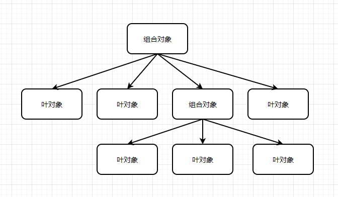

# 组合模式

## 什么是组合模式

组合模式就是用小的子对象来构建更大的对象，而这些小的子对象本身也许是由更小的‘孙对象’构成的。

简单来说，组合模式是一种树型结构，具有子对象的对象称为组合对象，不具有子对象的对象称为叶对象。请求从树的最顶端向下传递，类似二叉树的深度遍历。



## 组合模式的用途

-   表示树型结构。
-   统一对待组合对象和叶对象

## JavaScript 中的组合模式

由于组合模式统一对待组合对象和叶对象，所以需要保证组合对象和叶对象拥有同样的方法。在 JavaScript 中，对象的多态性是与生俱来的，也没有编译器检查变量的类型。所以通常需要用鸭子类型的思想进行接口检查。

## 组合模式的例子————扫描文件夹

文件系统中，文件夹对应组合对象，文件对应叶对象。当我们操作一个文件夹时，我们不需要关心文件夹中的内容，我们只需要对文件夹进行操作，然后文件夹操作会递归往下进行。

```js
const Folder = function(name) {
    this.name = name;
    this.files = [];
};

Folder.prototype.add = function(file) {
    this.files.push(file);
};

Folder.prototype.scan = function() {
    console.log('开始扫描文件夹：' + this.name);

    for (let i = 0, file, files = this.files; (file = files[i++]); ) {
        file.scan();
    }
};

const File = function(name) {
    this.name = name;
};

File.prototype.scan = function() {
    console.log(`开始扫描文件：${this.name}`);
};

File.prototype.add = function() {
    throw new Error('文件不能添加文件');
};

let folder = new Folder('前端');

let folder1 = new Folder('框架');
let folder2 = new Folder('JavaScript');

let file1 = new File('Html');
let file2 = new File('Css');
let file3 = new File('Vue');

folder1.add(file3);
folder2.add(file1);
folder2.add(file2);

folder.add(folder1);
folder.add(folder2);

folder.scan();
```

## 何时使用组合模式

-   表示对象的部分-整体层次结构。组合模式可以方便的构造一棵树来表示对象的部分-整体结构。
-   希望统一对待树中的所有对象。组合模式使用户可以忽略组合对象和叶对象的区别，客户在面对这棵树的时候，不用关心当前正在处理的对象是组合对象还是叶对象。

## 小结

组合模式并不是完美的，组合模式可能会产生这样一个系统：系统中的每个对象看起来都与其他对象差不多。他们的区别只有在运行时才会显现出来，这会使代码难以理解。此外，由于每个对象都必须保持统一，这就是创建的每个对象都必须具有对象自身所需方法，及组合模式统一方法，如果创建过多对象，可能会让系统不能负担。
