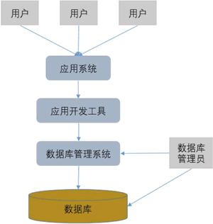

## 基础概念

http://c.biancheng.net/view/2415.html

-   数据：描述事物的符号
-   数据库（Database）：长期存储在计算机内的，有组织的，可共享的数据集合
-   数据库管理系统（DBMS）：数据库的核心软件之一，是位于用户与操作系统之间的数据管理软件，用于建立，使用和维护数据库。它的主要功能包括数据定义、数据操作、数据库的运行管理、数据库的建立和维护几个方面

## 关系型数据库和非关系型数据库

### 关系型数据库

关系型数据库是建立在关系模型基础上的数据库，借助于集合代数等数学概念和方法来处理数据库中的数据。简单说，关系型数据库是由多张能互相连接的表组成的数据库。

优点：

1. 都是使用表结构，格式一致，易于维护。
2. 使用通用的 SQL 语言操作，使用方便可用于复杂查询。
3. 数据存储在磁盘中，安全。

缺点：

1. 读写性能比较差，不能满足海量数据的高效率读写。
2. 不节省空间。因为建立在关系模型上，就要遵循某些规则，比如数据中某字段值即使为空仍要分配空间。
3. 固定的表结构，灵活度较低。

### 非关系型数据库

非关系型数据库又被称为 NoSql （Not Only SQL），意为不仅仅是 SQL。通常指数据以对象的形式存储在数据库中，而对象之间的关系通过每个对象自身的属性来决定。

优点：

1. 非关系型数据库存储数据的格式可以是 key-value 形式、文档形式、图片形式等。使用灵活，应用场景广泛，而关系型数据库只支持基础类型。
2. 速度快，效率高。NoSQL 可以使用硬盘或者随机存储器作为载体，而关系型数据库只能使用硬盘。
3. 海量数据的维护和处理非常轻松。
4. 非关系型数据库具有扩展简单、高并发、高稳定性、成本低廉的优势。
5. 可以实现数据的分布式处理。

缺点：

1. 非关系型数据库暂时不提供 SQL 支持，学习和使用成本较高。
2. 非关系型数据库没有事务处理，没有保证数据的完整性和安全性。适合处理海量数据，但是不一定安全。
3. 功能没有关系型数据库完善。

## 为什么要使用数据库

1. 数据库可以结构化存储大量的数据信息，方便用户进行有效的检索和访问。
2. 数据库可以有效的保持数据信息的一致性、完整性、降低数据冗余。
3. 数据库可以满足应用的共享和安全方面的要求，把数据放在数据库中在很多情况下也是出于安全考虑。
4. 数据库技术能够方便智能化的分析，产生新的有用信息。

## 数据库系统是什么？由哪几部分组成？

数据库系统（Database System， DBS）由硬件和软件共同构成。硬件主要用于存储数据库中的数据，包括计算机、存储设备等。软件主要包括数据库管理系统、支持数据库管理系统运行的操作系统，以及支持多种语言进行应用开发的访问技术等。

数据库系统是指在计算机系统中引入数据库后的系统。完整的数据库系统结构如图：

由图可知，一个完整的数据库系统一般由数据库、数据库管理系统、应用开发工具、应用系统、数据库管理员和用户组成。

数据库系统主要由以下三个部分组成：

1. 数据库：用于存储数据的地方
2. 数据库管理系统：用于管理数据库的软件
3. 数据库应用程序：为了提高数据库系统的处理能力所使用的管理数据库的软件补充。
