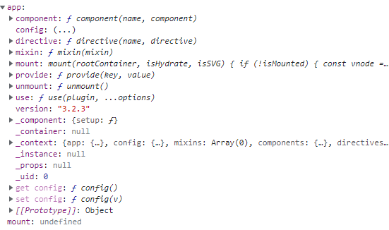
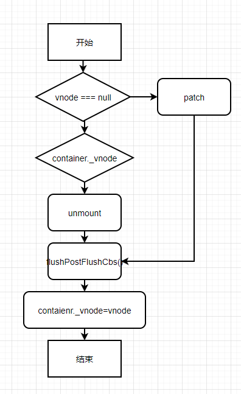

# Vue3 初始化流程

## Monorepo

Monorepo 是管理项目代码的一个方式，指在一个仓库(repo)中管理多个模块/包(package)

优点：

-   一个仓库可维护多个模块，不用到处找仓库
-   方便版本管理和依赖管理，模块之间的引用，调用都非常方便

缺点：仓库体积会变大

## 项目结构

```js
.
├── compiler-core       // 与平台无关的编译器核心
├── compiler-dom        // 针对浏览器的编译模块
├── compiler-sfc        // 针对单文件解析
├── compiler-ssr        // 针对服务端渲染的编译模块
├── global.d.ts
├── reactivity          // 响应式系统
├── ref-transform
├── runtime-core        //与平台无关的运行时核心（可以创建针对特定平台的运行时-自定义渲染器）
├── runtime-dom         // 针对浏览器的运行时，包括 DOM API，属性，事件等
├── runtime-test        // 运行时测试
├── server-renderer     // 用于服务端渲染
├── sfc-playground      // 在线渲染网站:https://sfc.vuejs.org/
├── shared              // 共享内容
├── size-check          // 测试代码体积
├── template-explorer   // 在线编译网站:https://vue-next-template-explorer.netlify.app/
├── vue                 // 完整版本，包括运行时和编译器
└── vue-compat          // 迁移构建版，用于兼容 Vue2 行为
```

## 从 createApp 开始

在 Vue3 中，新建 Vue 实例是通过 createApp 函数，而不是通过 new Vue。

从一个例子开始

```html
<div id="demo">
    <h1>{{state.msg}}</h1>
</div>

<script>
    const { createApp, reactive, effect, shallowReactive, track, trigger } = Vue;
    debugger;
    createApp({
        setup() {
            const state = reactive({
                msg: 'Hello World',
                showMsg: true,
            });

            effect(() => {
                console.log(state.msg);
            });

            setTimeout(() => {
                state.msg = 'Hello Vue3';
            }, 1000);

            return {
                state,
            };
        },
    }).mount('#demo');
</script>
```

可以看一下 createApp 函数干了些啥。

```ts
export const createApp = ((...args) => {
    const app = ensureRenderer().createApp(...args);

    const { mount } = app;
    app.mount = (containerOrSelector: Element | ShadowRoot | string): any => {
        const container = normalizeContainer(containerOrSelector);
        if (!container) return;

        const component = app._component;

        // clear content before mounting
        container.innerHTML = '';
        const proxy = mount(container, false, container instanceof SVGElement);
        if (container instanceof Element) {
            container.removeAttribute('v-cloak');
            container.setAttribute('data-v-app', '');
        }
        return proxy;
    };

    return app;
}) as CreateAppFunction<Element>;
```

光看主流程的话，可以看出 createApp 函数主要干了 3 件事：

1. 创建 app 实例
2. 重写 mount 函数
3. 将新的 mount 函数挂载到 app 实例上，并返回。

先看看 app 实例是个啥，它是一个提供应用上下文的应用实例。应用实例挂载的组件树共享同一个上下文。



可以看出 Vue 的全局属性和对象都挂载在 createApp 函数生成的 app 实例上，不用再像 Vue2 一样挂载在原型上。

再看 app 实例的创建过程

```ts
// lazy create the renderer - this makes core renderer logic tree-shakable
// in case the user only imports reactivity utilities from Vue.
let renderer: Renderer<Element | ShadowRoot> | HydrationRenderer;
function ensureRenderer() {
    return renderer || (renderer = createRenderer<Node, Element | ShadowRoot>(rendererOptions));
}
```

第一步是调用 ensureRenderer 函数生成 renderer 函数。通过上面的注释也告诉了我们为什么需要一个 ensureRenderer 函数来生成 renderer 函数。为了核心 renderer 的 tree-shakable。

ensureRenderer 函数调用了 createRenderer 函数来创建 renderer。

```ts
export function createRenderer<HostNode = RendererNode, HostElement = RendererElement>(
    options: RendererOptions<HostNode, HostElement>
) {
    return baseCreateRenderer<HostNode, HostElement>(options);
}
```

通过这个函数我们可以创建自定义渲染器。

继续看 baseCreateRenderer 这个函数。

```ts
// overload 1: no hydration
function baseCreateRenderer<HostNode = RendererNode, HostElement = RendererElement>(
    options: RendererOptions<HostNode, HostElement>
): Renderer<HostElement>;

// overload 2: with hydration
function baseCreateRenderer(
    options: RendererOptions<Node, Element>,
    createHydrationFns: typeof createHydrationFunctions
): HydrationRenderer;

// implementation
function baseCreateRenderer(
    options: RendererOptions,
    createHydrationFns?: typeof createHydrationFunctions
): any {
    // 省略

    return {
        render,
        hydrate,
        createApp: createAppAPI(render, hydrate),
    };
}
```

这个函数很复杂，将近两千行，所以先略过具体实现，直接看返回值。在返回值里面有我们需要的 createApp。是由 createAppAPI 函数创建的。

```ts
export function createAppAPI<HostElement>(
    render: RootRenderFunction,
    hydrate?: RootHydrateFunction
): CreateAppFunction<HostElement> {
    return function createApp(rootComponent, rootProps = null) {
        // 忽略参数判断

        const context = createAppContext();
        const installedPlugins = new Set();

        let isMounted = false;

        const app: App = (context.app = {
            _uid: uid++,
            _component: rootComponent as ConcreteComponent,
            _props: rootProps,
            _container: null,
            _context: context,
            _instance: null,

            version,

            get config() {
                return context.config;
            },

            set config(v) {
                if (__DEV__) {
                    warn(`app.config cannot be replaced. Modify individual options instead.`);
                }
            },
            use(plugin: Plugin, ...options: any[]) {
                // 忽略具体实现
                return app;
            },

            mixin(mixin: ComponentOptions) {
                // 忽略具体实现
                return app;
            },

            component(name: string, component?: Component): any {
                // 忽略具体实现
                return app;
            },

            directive(name: string, directive?: Directive) {
                // 忽略具体实现
                return app;
            },

            mount(rootContainer: HostElement, isHydrate?: boolean, isSVG?: boolean): any {
                // 忽略具体实现
            },

            unmount() {
                // 忽略具体实现
            },

            provide(key, value) {
                // 忽略具体实现

                return app;
            },
        });

        if (__COMPAT__) {
            installAppCompatProperties(app, context, render);
        }

        return app;
    };
}
```

这个函数直接返回了 createApp 函数，createApp 函数又返回了一个 app 实例。
在这个函数里可以看到第一张图的所有属性。

看一下这个函数做了些啥事。

首先创建了一个 context，这个 context 是一个默认对象，即应用上下文。

```ts
{
    app: null as any,
    config: {
      isNativeTag: NO,
      performance: false,
      globalProperties: {},
      optionMergeStrategies: {},
      errorHandler: undefined,
      warnHandler: undefined,
      compilerOptions: {}
    },
    mixins: [],
    components: {},
    directives: {},
    provides: Object.create(null),
    optionsCache: new WeakMap(),
    propsCache: new WeakMap(),
    emitsCache: new WeakMap()
  }
```

接下来定义了一个 installedPlugins。用来保存已经初始化过的插件。

isMounted 表示 app 是否挂载。

然后创建 app 对象。定义了一些属性，然后重写了 get 和 set。get 时直接返回 context.config，set 时不做操作。也就是 readonly。

然后就是一系列的函数。

第一个是 use 函数。

app.use 用于注册全局插件。逻辑非常简单。首先判断当前插件是否已经被注册过，注册过则忽略，否则判断当前插件是否存在 install 函数，存在则调用 plugin.install(app, ...options),并将插件缓存，否则判断当前插件是否为函数，是则直接执行并缓存，否则忽略。最后返回 app 实例。

app.mixin 则是将 mixin 缓存。app.component 和 app.directive 同理。

## mount

回到 vue3 项目中创建一个 Vue 实例。

```js
createApp(APP).mount('#app)
```

由前文可知，createApp 函数返回的是一个 Vue 实例。现在我们就来看看创建 Vue 实例时 mount 流程。

1. Vue 实例上挂载的 mount 函数，位于 runtime-dom/index.ts
2. mount 函数，位于 runtime-core/src/apiCreateApp.ts 下 createAppAPI 函数中

第一个 mount 函数其实是对第二个 mount 函数执行前做了一些容器的初始化工作和条件判断，第二个 mount 函数则是真正的挂载函数流程，我们主要看第二个 mount 函数。

1. 执行 createVNode 函数生成 vnode，位于 runtime-core/src/vnode.ts
2. 执行 render 函数，位于 runtime-core/src/renderer.ts
3. 修改 mounted 状态，缓存 rootContainer
4. 返回 vnode 组件代理

我们先跳过 createVNode 函数的具体实现，只需要知道这个函数返回的是一个 vnode 对象。进入 render 函数。

这个 render 函数是在 baseCreateRenderer 函数中定义的，这个函数在 createApp 函数的流程中执行，我们这里的 render 函数是 baseCreateRenderer 函数的闭包。

在这个函数中除了 render 函数还定义了其它的功能函数。

render 函数接收三个参数:

-   vnode: 虚拟 DOM
-   container: 容器
-   isSVG: 是否为 SVG

render 函数做的事情很简单

<div align=center></div>

render 函数 首先会对 vnode 做判断，如果 vnode 为 null，则说明新的虚拟 DOM 为空，则只需要执行 unmount 将老的内容从页面卸载。如果不为空，则进入 patch 流程。patch 结束后，执行 flushPostFlushCbs 函数，最后将 vnode 缓存在 container 上。

## 小结

这个流程中 createAppAPI 函数只是返回了一个函数，并赋值给 baseCreateRenderer 函数的返回值，这个时候 baseCreateRenderer 函数的返回值为

-   render,
-   hydrate,
-   createApp: createAppAPI(render, hydrate)

这个函数并没有被执行。最后返回给 renderer。然后再调用 renderer.createApp 生成 app 实例。
